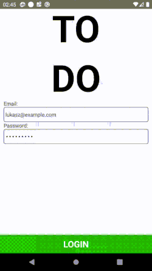

**Geekle Conference Todo App**

This is an app for my talk at a ([Cross-platform Development Summit 2020 by Geekle](https://crossplatform.geekle.us/).

This is a React Native based mobile app.

This app uses:

- redux
- redux-saga
- react-navigation
- rnfirebase.io Firebase plugin

**IMPORTANT**
Before running this app, please rename the package name (right now it is pl.baldy.todoapp) and generate your own firebase project at [enter link description here](console.firebase.google.com)

**How to run it?**

Simply clone this repository.
Install the dependencies: `npm i`
Install the pods: `npx pod-install`
Run the app: `react-native run-ios` or `react-native run-android`
